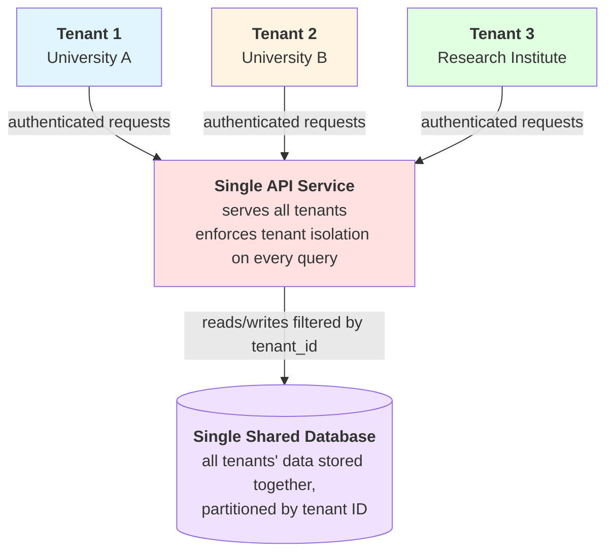

# Tenants

:::info

A **Tenant** refers to an entity (*e.g. an organization*) that uses the application independently without the need of different deployments. There is also a *default* tenant for use that is not editable.

:::

In this page, there is a listing where you can view details about all the available tenants.

The information displayed by default is: the `display name` of the tenants, the `status`, the `identification code` and timestamps for the `creation` and `updates` of the records. At the top right corner of the listing you can also select which columns to display.

:::tip

For tenants, all the columns are visible by default.

:::

You can also create new or edit / remove tenants by clicking to the `Create Tenant` button at the top right of the page or to the three dots at the last column, respectively.

## Authorization

Only users that have the global **Admin** role or the global **InstallationAdmin** role can access this page.

## Navigation

This view is available when the user presses the `Tenants` link from the side navigation menu.

## Pagination

Not all the records are being displayed at once. By default, there is a pagination of 10 records applied to them.

You can control how many records are being displayed at any time, by adjusting the `items per page` control at the bottom left corner of the table.

## Filtering

There is a filtering option available for tenants.

- **Is Active**: By toggling this control you can view only the active or only the disabled tenants. *By default, this option is set to true.*

In order for the filters to apply, you have to click the `Apply filters` button. 

You can also clear any filters already applied, by pressing the `clear all filters` option, located at the top of the popup.

---

## Edit form

There are three options available for a tenant.

- **Name**: The display name for the tenant. This name will appear on the UI.
- **Code**: The identifier for the tenant, used internally by the system.
- **Description**: A short description for the tenant. *This is optional.*

A tenant, once created can be configured on the [Tenant Configuration](admin-guide/tenant-management/tenant-configuration.md) page.

---

## Multitenancy

There is always one tenant available on the platform and is called `Default`. It is the tenant assigned by default to all the entities (users, descriptions etc.), unless the tenant scope that is being selected is different.

There are two ways a user can change the tenant scope.
- Select a tenant from the top toolbar, on the dropdown appearing next to the notifications icon.
- Select a tenant from the user profile page

:::tip

The options to change the tenant scope are only available when the logged in user belongs to one or more tenants. Otherwise, the user is attached only to the default tenant. Also, system administrators which are users having the global `Admin` role can select from all the available tenants.

:::

