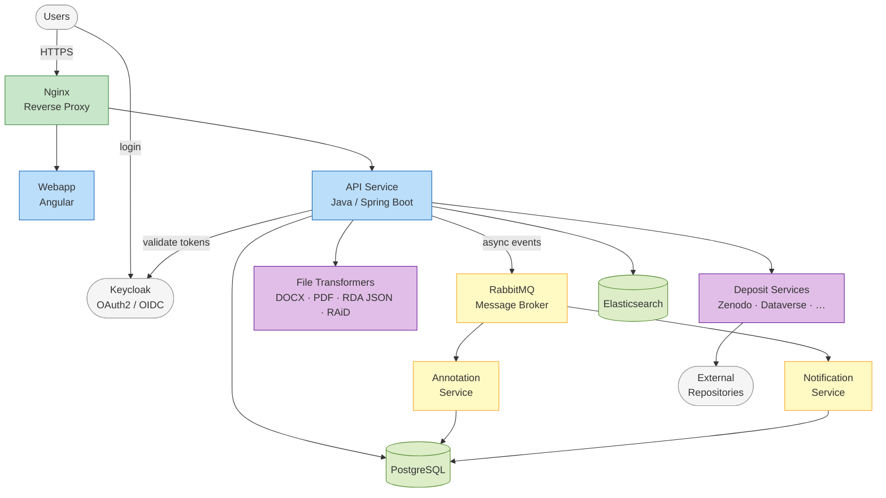

# System Architecture

OpenCDMP is built on a **microservices architecture** — each capability runs as an independent Docker container, communicating through well-defined APIs and an async message bus. This allows each service to be developed, deployed, and scaled independently.

---

## Services

### Nginx — Reverse Proxy

The sole service exposed to the internet. Handles SSL/TLS termination, routes incoming requests to the Webapp or API, and hides all internal services from direct external access.

### Webapp — Angular Frontend

Serves the browser-based user interface. Communicates exclusively with the API Service and authenticates users via Keycloak.

### API Service — Java Backend

The core of the platform. Handles all business logic, exposes the REST API consumed by the Webapp, orchestrates plugin calls (file transformers, deposit services), writes to PostgreSQL, indexes to Elasticsearch, and publishes events to RabbitMQ.

### Annotation Service

Manages the annotations (comments and reviews) lifecycle — creating, resolving, and tracking annotation threads on plans and descriptions. *Closed source, free-to-use license.*

### Notification Service

Sends email and in-app notifications triggered by platform events (invitations, status changes, annotations, etc.). Templates and preferences are configurable. *Closed source, free-to-use license.*

### RabbitMQ — Message Broker

Decouples the API Service from the Annotation and Notification services. The API publishes domain events; downstream services subscribe and react asynchronously.

### PostgreSQL — Primary Database

Stores all persistent application data: plans, descriptions, blueprints, templates, users, configuration, and annotation records.

### Elasticsearch — Search Index

Powers full-text search across plans and descriptions. The API keeps the index in sync on every create, update, and delete operation.

### File Transformers — Pluggable Export/Import

Independent Spring Boot microservices, one per format. Each transformer implements a standard interface and registers with OpenCDMP at startup. PDF export is handled by the DOCX transformer — there is no separate PDF service. See [File Transformer Plugin](developers/plugins/file-transformers.md).

### Deposit Services — Pluggable DOI Assignment

Independent Spring Boot microservices, one per repository. Each service authenticates with its target repository, uploads the plan files, and returns the minted DOI. See [Deposit Plugin](developers/plugins/deposit.md).

### Keycloak — Authentication

Manages user identities, roles, and access tokens. Both the Webapp (user login) and the API Service (token validation) integrate with Keycloak via OAuth2/OIDC.
