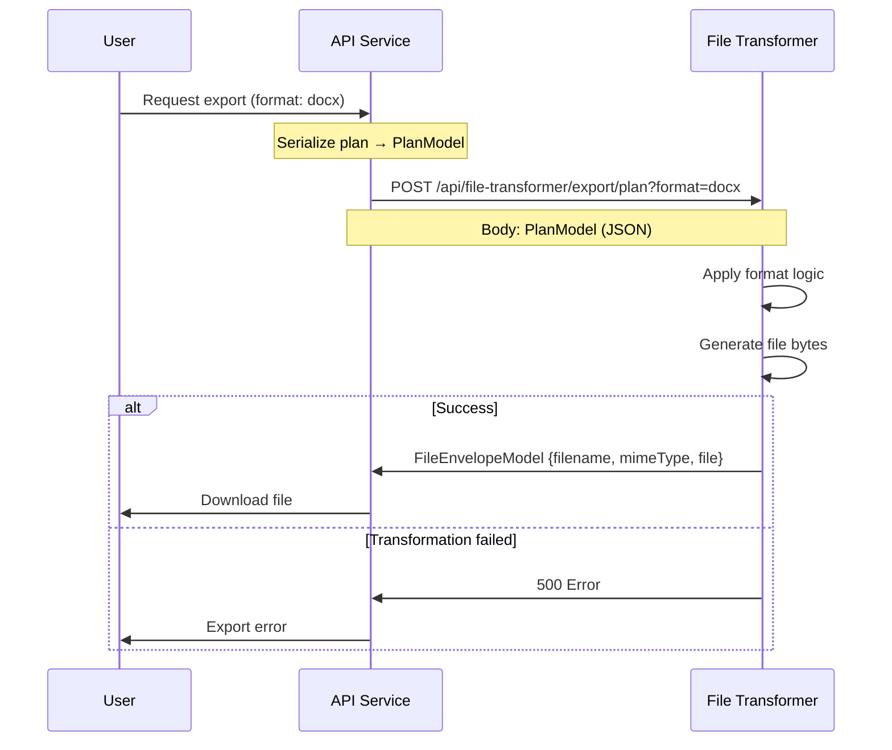

# File Transformer

:::info
[File Transformer Base](https://mvnrepository.com/artifact/org.opencdmp/file-transformer-base) is a **Maven package** that provides the base interfaces and configuration classes required to implement custom file transformer services for the **OpenCDMP** platform. Each file transformer is an independent Spring Boot microservice that registers with OpenCDMP to support import and export operations for a specific file format.
:::

## How It Works

When a user exports a plan or description, or imports from a file, the OpenCDMP backend:

1. Looks up the registered file transformer for the requested format.
2. Serializes the plan or description into [Common Models](/docs/developers/plugins/common-models.md) (`PlanModel`, `DescriptionModel`).
3. Calls the transformer's REST API with the model as the request body.
4. Receives back a `FileEnvelopeModel` (for export) or a `PlanModel`/`DescriptionModel` (for import).

Your transformer is responsible for everything in between — rendering, parsing, mapping fields — using whatever libraries suit your format.



---

## Key Interfaces and Classes

### 1. FileTransformerClient

This interface defines the business logic operations your transformer must implement.

```java
public interface FileTransformerClient {

    // Export a plan to a file in the specified format variant
    FileEnvelopeModel exportPlan(PlanModel plan, String variant)
        throws InvalidApplicationException, IOException, InvalidTypeException;

    // Import a plan from a file, mapped to the provided blueprint
    PlanModel importPlan(PlanImportModel planImportModel);

    // Export a single description to a file
    FileEnvelopeModel exportDescription(DescriptionModel descriptionModel, String format)
        throws InvalidApplicationException, IOException;

    // Import a description from a file, mapped to the provided template
    DescriptionModel importDescription(DescriptionImportModel descriptionImportModel);

    // Return this transformer's capabilities (supported formats, entity types)
    FileTransformerConfiguration getConfiguration();

    // Inspect a file before import and return structural info about it (optional)
    PreprocessingPlanModel preprocessingPlan(FileEnvelopeModel fileEnvelopeModel);
    PreprocessingDescriptionModel preprocessingDescription(FileEnvelopeModel fileEnvelopeModel);
}
```

Methods you do not need to support can return `null` or throw `UnsupportedOperationException` — declare only the formats you actually handle in your `FileTransformerConfiguration`.

### 2. FileTransformerController

This interface defines the REST API endpoints your microservice must expose. Implement it as a `@RestController` and delegate each method to your `FileTransformerClient`.

```java
@RequestMapping("/api/file-transformer")
public interface FileTransformerController {

    @PostMapping("/export/plan")
    FileEnvelopeModel exportPlan(@RequestBody PlanModel planModel,
        @RequestParam(value = "format", required = false) String format) throws Exception;

    @PostMapping("/export/description")
    FileEnvelopeModel exportDescription(@RequestBody DescriptionModel descriptionModel,
        @RequestParam(value = "format", required = false) String format) throws Exception;

    @PostMapping("/import/plan")
    PlanModel importFileToPlan(@RequestBody PlanImportModel planImportModel);

    @PostMapping("/import/description")
    DescriptionModel importFileToDescription(@RequestBody DescriptionImportModel descriptionImportModel);

    @PostMapping("/preprocessing/plan")
    PreprocessingPlanModel preprocessingPlan(@RequestBody FileEnvelopeModel fileEnvelopeModel);

    @PostMapping("/preprocessing/description")
    PreprocessingDescriptionModel preprocessingDescription(@RequestBody FileEnvelopeModel fileEnvelopeModel);

    @GetMapping("/formats")
    FileTransformerConfiguration getSupportedFormats();
}
```

### 3. FileTransformerConfiguration

Return this from `getConfiguration()` / `getSupportedFormats()` to tell the platform what your transformer can do.

```java
public class FileTransformerConfiguration {
    private String fileTransformerId;                         // Unique ID for this transformer
    private List<FileFormat> exportVariants;                  // Formats this transformer can export
    private List<FileTransformerEntityType> exportEntityTypes; // Plan | Description
    private List<FileFormat> importVariants;                  // Formats this transformer can import
    private List<FileTransformerEntityType> importEntityTypes;
    private boolean useSharedStorage;                         // Whether to use shared file storage
    private List<ConfigurationField> configurationFields;     // Admin-configured fields (API keys, templates)
    private List<ConfigurationField> userConfigurationFields; // User-configured fields (personal tokens)
}
```

**`FileFormat`** describes a single supported format:

```java
public class FileFormat {
    private String format;   // Format identifier string (e.g. "docx", "pdf", "rda-json")
    private Boolean hasLogo; // Whether a logo/icon is associated
    private String icon;     // Icon identifier or URL
}
```

### 4. Import Models

**`PlanImportModel`** — the input to `importPlan`. Contains the uploaded file and the blueprint to map into:

```java
public class PlanImportModel {
    private PlanBlueprintModel blueprint;            // The target blueprint structure
    private List<DescriptionModel> descriptions;     // Existing descriptions (if any)
    private FileEnvelopeModel fileEnvelope;          // The uploaded file
}
```

**`DescriptionImportModel`** — the input to `importDescription`:

```java
public class DescriptionImportModel {
    private DescriptionTemplateModel descriptionTemplate; // The target template
    private UUID sectionId;                               // Which plan section to import into
    private FileEnvelopeModel fileEnvelope;               // The uploaded file
}
```

### 5. Preprocessing Models

Preprocessing is called before import to let the transformer inspect the file and return structural information — for example, to let the user map sections from the file to blueprint sections.

```java
public class PreprocessingPlanModel {
    // Return structured metadata about the file content
    // (e.g. section titles found in the document)
}

public class PreprocessingDescriptionModel {
    // Return structured metadata about the file content
}
```

If your transformer does not support preprocessing, return `null` from these methods.

---

## How to Create a Custom File Transformer

### Prerequisites

- Java 21+
- Spring Boot 3.x
- Maven 3.6+

### Step 1 — Create a Spring Boot Project

Create a new Maven-based Spring Boot project. Add the following dependencies to your `pom.xml`:

```xml
<dependencies>
    <!-- OpenCDMP base interfaces -->
    <dependency>
        <groupId>org.opencdmp</groupId>
        <artifactId>file-transformer-base</artifactId>
        <version>1.2.0</version>
    </dependency>

    <!-- Common models (transitive via file-transformer-base, but explicit is clearer) -->
    <dependency>
        <groupId>org.opencdmp</groupId>
        <artifactId>common-models</artifactId>
        <version>1.2.0</version>
    </dependency>

    <!-- Spring Boot -->
    <dependency>
        <groupId>org.springframework.boot</groupId>
        <artifactId>spring-boot-starter-web</artifactId>
    </dependency>
</dependencies>
```

### Step 2 — Implement FileTransformerClient

Create a `@Service` class that implements the business logic:

```java
@Service
public class MyFormatFileTransformerService implements FileTransformerClient {

    @Override
    public FileTransformerConfiguration getConfiguration() {
        FileTransformerConfiguration config = new FileTransformerConfiguration();
        config.setFileTransformerId("my-format-transformer");

        // Declare supported export formats
        FileFormat exportFormat = new FileFormat();
        exportFormat.setFormat("myformat");
        config.setExportVariants(List.of(exportFormat));
        config.setExportEntityTypes(List.of(FileTransformerEntityType.Plan));

        // Declare supported import formats (if applicable)
        config.setImportVariants(List.of(exportFormat));
        config.setImportEntityTypes(List.of(FileTransformerEntityType.Plan));

        return config;
    }

    @Override
    public FileEnvelopeModel exportPlan(PlanModel plan, String variant)
            throws InvalidApplicationException, IOException {

        // 1. Read the plan data you need
        String title = plan.getLabel();
        List<DescriptionModel> descriptions = plan.getDescriptions();

        // 2. Build the output file in your format
        byte[] fileContent = renderPlanToMyFormat(plan);

        // 3. Return the result as a FileEnvelopeModel
        FileEnvelopeModel result = new FileEnvelopeModel();
        result.setFilename(title + ".myformat");
        result.setMimeType("application/x-myformat");
        result.setFile(fileContent);
        return result;
    }

    @Override
    public PlanModel importPlan(PlanImportModel importModel) {
        byte[] fileContent = importModel.getFileEnvelope().getFile();
        PlanBlueprintModel blueprint = importModel.getBlueprint();

        // Parse the file and map fields back to a PlanModel
        PlanModel result = new PlanModel();
        // ... populate fields from the parsed file ...
        return result;
    }

    @Override
    public FileEnvelopeModel exportDescription(DescriptionModel description, String format)
            throws InvalidApplicationException, IOException {
        // Export a single description
        // Return null or throw UnsupportedOperationException if not supported
        return null;
    }

    @Override
    public DescriptionModel importDescription(DescriptionImportModel importModel) {
        return null; // Not supported
    }

    @Override
    public PreprocessingPlanModel preprocessingPlan(FileEnvelopeModel fileEnvelope) {
        return null; // Not supported
    }

    @Override
    public PreprocessingDescriptionModel preprocessingDescription(FileEnvelopeModel fileEnvelope) {
        return null; // Not supported
    }

    private byte[] renderPlanToMyFormat(PlanModel plan) {
        // Your format-specific rendering logic here
        return new byte[0];
    }
}
```

#### Reading Description Field Answers

Description answers are stored in `description.getProperties()`. The structure is:

```text
PropertyDefinitionModel
  └── fieldSets: Map<fieldSetId, PropertyDefinitionFieldSetModel>
        └── items: List<PropertyDefinitionFieldSetItemModel>  (one per multiplicity row)
              └── fields: Map<fieldId, FieldModel>
                    └── textValue / booleanValue / dateValue / references / file / ...
```

To read a specific answer:

```java
PropertyDefinitionModel props = description.getProperties();
if (props == null || props.getFieldSets() == null) return;

PropertyDefinitionFieldSetModel fieldSet = props.getFieldSets().get("fieldSetId");
if (fieldSet == null || fieldSet.getItems() == null) return;

for (PropertyDefinitionFieldSetItemModel item : fieldSet.getItems()) {
    FieldModel answer = item.getFields().get("fieldId");
    if (answer != null && answer.getTextValue() != null) {
        String value = answer.getTextValue();
        // use the value
    }
}
```

To find the `fieldSetId` and `fieldId` values, inspect the `DescriptionTemplateModel` definition passed with the model.

### Step 3 — Implement FileTransformerController

Create a `@RestController` that implements the controller interface and delegates to your service:

```java
@RestController
public class MyFormatTransformerController implements FileTransformerController {

    private final MyFormatFileTransformerService service;

    public MyFormatTransformerController(MyFormatFileTransformerService service) {
        this.service = service;
    }

    @Override
    public FileEnvelopeModel exportPlan(PlanModel planModel, String format) throws Exception {
        return service.exportPlan(planModel, format);
    }

    @Override
    public PlanModel importFileToPlan(PlanImportModel planImportModel) {
        return service.importPlan(planImportModel);
    }

    @Override
    public FileEnvelopeModel exportDescription(DescriptionModel descriptionModel, String format) throws Exception {
        return service.exportDescription(descriptionModel, format);
    }

    @Override
    public DescriptionModel importFileToDescription(DescriptionImportModel descriptionImportModel) {
        return service.importDescription(descriptionImportModel);
    }

    @Override
    public PreprocessingPlanModel preprocessingPlan(FileEnvelopeModel fileEnvelopeModel) {
        return service.preprocessingPlan(fileEnvelopeModel);
    }

    @Override
    public PreprocessingDescriptionModel preprocessingDescription(FileEnvelopeModel fileEnvelopeModel) {
        return service.preprocessingDescription(fileEnvelopeModel);
    }

    @Override
    public FileTransformerConfiguration getSupportedFormats() {
        return service.getConfiguration();
    }
}
```

### Step 4 — Create the Application Entry Point

```java
@SpringBootApplication(scanBasePackages = {
    "org.opencdmp.filetransformerbase",
    "com.example.myformattransformer"   // your package
})
public class MyFormatTransformerApplication {
    public static void main(String[] args) {
        SpringApplication.run(MyFormatTransformerApplication.class, args);
    }
}
```

### Step 5 — Configure and Deploy

Set the server port and any other application settings in `application.yml`:

```yaml
server:
  port: 8085   # Choose a port that does not conflict with other services

spring:
  application:
    name: my-format-transformer
```

Build and run the service as a standalone JAR or Docker container, accessible on the network from the OpenCDMP backend.

### Step 6 — Register with OpenCDMP

Once your service is running, register it as a file transformer in OpenCDMP via the [Tenant Configuration](/docs/admin-guide/tenant-management/tenant-configuration.md) page. You will need to provide the base URL of your running service. The platform will call `GET /api/file-transformer/formats` to discover the transformer's capabilities and make its formats available to users.

---

## Reference Implementations

The following open-source transformers are part of the OpenCDMP platform and serve as complete examples:

| Project | Format | GitHub |
|---------|--------|--------|
| `file-transformer-docx` | Microsoft Word (.docx) | [GitHub](https://github.com/OpenCDMP/file-transformer-docx) |
| `file-transformer-rda-json` | RDA maDMP JSON | [GitHub](https://github.com/OpenCDMP/file-transformer-rda-json) |
| `file-transformer-raid-json` | RAID JSON | [GitHub](https://github.com/OpenCDMP/file-transformer-raid-json) |

---

## License

This package is licensed under the [EUPL 1.2 License](https://github.com/OpenCDMP/file-transformer-base/blob/main/LICENSE).

## Contact

For questions or support regarding the implementation of file transformers, please contact:

- **Email**: opencdmp at cite.gr

:::note
You can view the `File Transformer Base` source code [here](https://github.com/OpenCDMP/file-transformer-base).
:::
