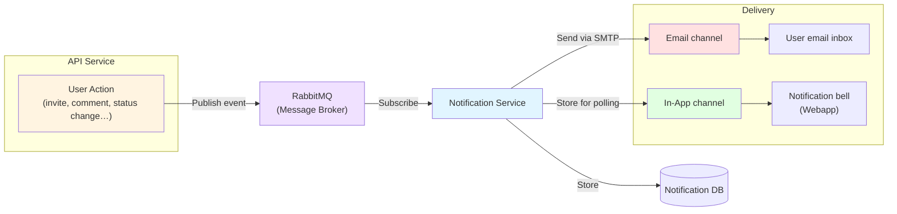

# Notifications

The `Notifications Service` is responsible to inform users about important events taking place in the platform that relate with them. The contents of these notifications can be [configured](administering/system-configuration/notification-templates.md) and they depend on the type of notification. By type, we mean the event that triggered them. For example, if a user gets invited to a [plan](using/plans/index.md), this is considered an event and a notification gets pushed to the user it refers to.

The notifications sent, can use one of the following available channels. They can either be `InApp` or `Email`. More details about these notification channels can be found on the links below.

## How Notifications Flow

import DocCardList from '@theme/DocCardList';

<DocCardList />