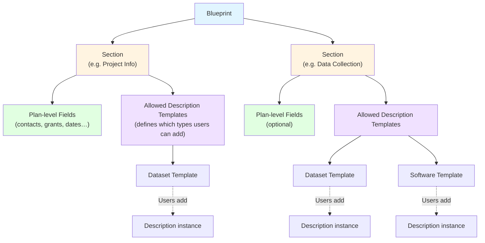

# Blueprints

A Blueprint defines how a [Plan](user-guide/plans/index.md) is structured. It consists of one or more **Sections**, each of which can hold fields that describe the plan overall (such as title, contacts, or funding) and/or slots for [Descriptions](user-guide/descriptions/index.md) based on selected [Description Templates](user-guide/templates.md).

Key rules:

- At least one section in a Blueprint must allow Descriptions to be added.
- A section does not have to include Descriptions — it can contain only plan-level fields.
- When you create a Plan, you choose a Blueprint, and the Plan inherits its section structure. You cannot change the Blueprint after the Plan is created.

:::info Admin-only
Blueprints are created and managed by administrators. As an end user, you **select** a Blueprint when creating a new Plan but cannot create or edit Blueprints yourself.

If you cannot find a suitable Blueprint, contact your OpenCDMP administrator. Details on creating Blueprints are in the [Blueprint Administration](admin-guide/content-management/blueprints/index.md) section.
:::
