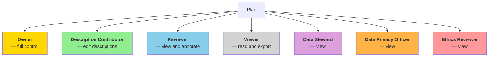

# Invite collaborators

The plan can be further edited by inviting users in order to collaborate on it and complete it. There are two methods to invite users:

- **External**: If the user is registered in the application, then a notification (email or in App) gets sent to him. If not, a registration email is being sent instead.
- **Internal**: It's a quick way, that we can invite users already associated to other plans we work with as well.

*Invite users*

For each member, a role on the plan must be defined. There are seven roles:

| Role | Capabilities |
|---|---|
| **Owner** | Full control — edit all plan content, manage collaborators, change status, deposit, delete |
| **Description Contributor** | Edit descriptions within the plan; view all plan content |
| **Reviewer** | View all plan content; create and reply to annotations |
| **Viewer** | Read-only access; export plan |
| **Data Steward** | View plan; perform data stewardship activities |
| **Data Privacy Officer** | View plan; perform privacy oversight activities |
| **Ethics Reviewer** | View plan; perform ethics review activities |

:::note
- All roles can view annotations on the entire plan.
- Roles can be applied to an entire plan or restricted to a specific section.
:::